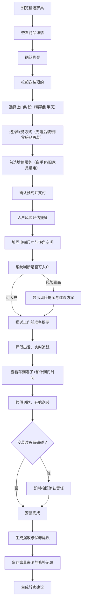

## 1. 产品概述

「居雅送装」是一款面向中高端二手家具买家的预约式送装 App，核心解决"淘到好家具后，如何像新家具一样准时送装到家"的体验痛点。目标用户是注重品质与服务感的体验型买家，他们愿意为省心、专业、有仪式感的送装服务付费，而非单纯比价。

- 核心价值：让二手家具的送装体验超越新家具，从预约到入户全程可控、可追踪、可信赖
- 目标市场：一线城市中高端二手家具买家（原木/中古/设计师家具爱好者）

## 2. 核心功能

### 2.1 用户角色

| 角色 | 注册方式 | 核心权限 |
|------|----------|----------|
| 买家用户 | 手机号注册 | 浏览商品、下单送装、预约时段、追踪履约、查看售后档案 |
| 安装师傅 | 后台分配 | 接单、更新履约状态、上传安装照片 |

### 2.2 功能模块

1. **首页（精选下单）**：精选二手家具展示、快速搜索、分类筛选、成交后拉起送装预约
2. **预约页（时段预约）**：精确到半天的上门时间选择、服务方式选择（先送后装/到货验品再装）、增值服务勾选（白手套/旧家具带走）
3. **准备页（上门准备）**：入户风险提醒（根据材质尺寸）、电梯尺寸与转角空间确认、上门前提示推送（地垫清洁/通道清空）
4. **追踪页（履约追踪）**：实时查看车到哪了、预计到门时间、师傅信息与资历展示、细小磕碰即时拍照确认
5. **档案页（售后档案）**：安装完成后的摆放与保养建议、每件家具的来源与修补记录、后续再次转卖建议

### 2.3 页面详情

| 页面名称 | 模块名称 | 功能描述 |
|----------|----------|----------|
| 首页 | Hero 横幅 | 展示品牌理念与核心服务承诺，自动轮播精选案例 |
| 首页 | 精选家具推荐 | 卡片式展示高评分二手家具，含图片、名称、材质、尺寸、价格 |
| 首页 | 快速分类导航 | 原木/中古/办公/设计师等风格分类入口 |
| 商品详情页 | 商品信息 | 大图展示、材质说明、尺寸规格、入户风险预判提示 |
| 商品详情页 | 送装服务入口 | 成交后自动拉起送装预约弹窗，展示可选服务与价格 |
| 预约页 | 时段选择器 | 日历视图，精确到上午/下午，已约满时段灰显 |
| 预约页 | 服务方式选择 | "先送后装"和"到货验品再装"两种方式对比说明 |
| 预约页 | 增值服务 | 白手套服务、旧家具带走等可勾选项 |
| 准备页 | 入户风险提醒 | 根据家具材质和尺寸自动生成风险提示（如大件转角风险、易损面提醒） |
| 准备页 | 电梯与通道确认 | 用户填写电梯尺寸、转角空间，系统判断是否可入户 |
| 准备页 | 上门前提示 | 推送地垫清洁、通道清空、宠物隔离等准备事项 |
| 追踪页 | 实时位置地图 | 展示送装车辆实时位置与预计到门时间 |
| 追踪页 | 师傅信息卡 | 师傅头像、姓名、资历年限、擅长风格标签 |
| 追踪页 | 磕碰拍照确认 | 安装过程中发现细小磕碰可即时拍照上传，标注责任方 |
| 档案页 | 保养建议卡 | 根据家具材质生成摆放与保养建议 |
| 档案页 | 来源与修补记录 | 展示家具来源、历次修补记录时间线 |
| 档案页 | 转卖建议 | 基于市场行情给出后续再次转卖的价格区间与时机建议 |

## 3. 核心流程

用户从浏览家具到完成送装并生成售后档案的完整流程：

## 4. 用户界面设计

### 4.1 设计风格

- **主色调**：暖胡桃木色（#8B6914）+ 柔和奶白（#FAF7F0），传递温暖可信的家具感
- **辅助色**：深炭灰（#2D2D2D）用于文字、鼠尾草绿（#7C9A6E）用于成功/确认状态
- **按钮风格**：圆角矩形（8px），主按钮使用暖胡桃木色填充，次按钮为描边样式
- **字体**：标题使用 Noto Serif SC（衬线体，传递精致感），正文使用 Noto Sans SC
- **布局风格**：卡片式布局，大量留白，顶部导航 + 底部 Tab 切换
- **图标风格**：线性图标（lucide-react），配合手绘感装饰元素

### 4.2 页面设计概览

| 页面名称 | 模块名称 | UI 元素 |
|----------|----------|----------|
| 首页 | Hero 横幅 | 全宽背景图+品牌标语，暖色渐变遮罩，淡入动画 |
| 首页 | 精选家具推荐 | 横向滚动卡片，悬浮阴影，点击缩放反馈 |
| 首页 | 快速分类导航 | 圆形图标+文字标签，2行4列网格 |
| 商品详情页 | 商品信息 | 顶部大图轮播，底部信息面板上滑，风险标签红色角标 |
| 商品详情页 | 送装预约弹窗 | 底部弹起半屏弹窗，毛玻璃背景，服务选项卡片 |
| 预约页 | 时段选择器 | 7天日历+上下午分段，可选时段高亮，已满时段灰显 |
| 预约页 | 服务方式选择 | 左右对比卡片，选中态暖胡桃木色边框+勾选图标 |
| 预约页 | 增值服务 | 开关式勾选，价格标签，选中后底部总价更新动画 |
| 准备页 | 入户风险提醒 | 风险等级色条（绿/黄/红），图标+文字说明，可展开详情 |
| 准备页 | 电梯与通道确认 | 表单输入，实时计算结论，动画过渡结果状态 |
| 准备页 | 上门前提示 | 时间线式准备清单，勾选打卡，进度条 |
| 追踪页 | 实时位置地图 | 简化地图视图，车辆图标+轨迹线，倒计时卡片 |
| 追踪页 | 师傅信息卡 | 头像+星级+擅长标签，横向滚动标签组 |
| 追踪页 | 磕碰拍照确认 | 拍照按钮+缩略图列表，标注弹窗 |
| 档案页 | 保养建议卡 | 材质配图+建议列表，可收藏 |
| 档案页 | 来源与修补记录 | 垂直时间线，图标节点，照片缩略图 |
| 档案页 | 转卖建议 | 价格区间图表+时机建议卡片 |

### 4.3 响应式设计

- 桌面优先设计，最大内容宽度 1200px 居中
- 平板端：双列卡片布局，侧边栏折叠
- 移动端：单列布局，底部 Tab 导航，卡片全宽

### 4.4 3D 场景指引

不适用，本项目不涉及 3D 场景。
