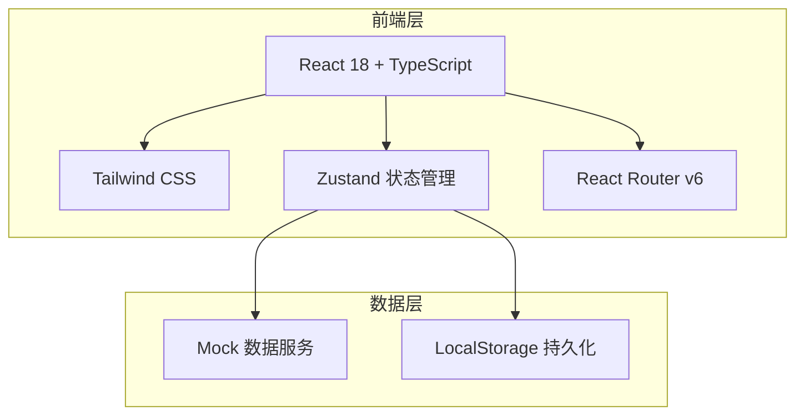
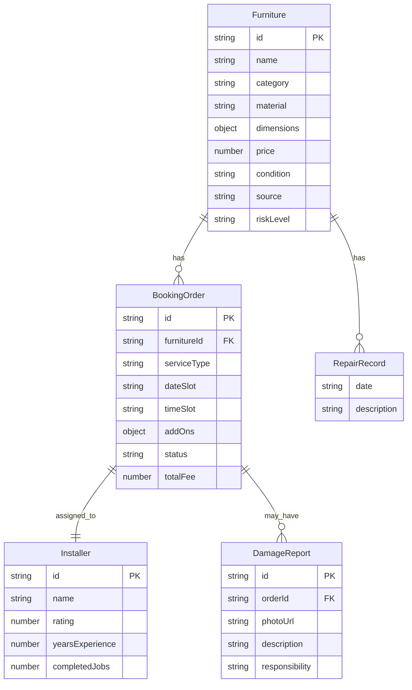

## 1. 架构设计



## 2. 技术说明

- **前端框架**：React@18 + TypeScript + Vite
- **样式方案**：Tailwind CSS@3
- **状态管理**：Zustand
- **路由**：React Router DOM v6
- **图标库**：lucide-react
- **初始化工具**：vite-init（react-ts 模板）
- **后端**：无后端，使用 Mock 数据
- **数据库**：无数据库，使用 LocalStorage + 内存数据

## 3. 路由定义

| 路由 | 用途 |
|------|------|
| `/` | 首页 - 精选家具展示与分类导航 |
| `/product/:id` | 商品详情页 - 家具详情与送装预约入口 |
| `/booking/:id` | 预约页 - 时段选择与服务方式配置 |
| `/prepare/:id` | 准备页 - 入户风险提醒与上门前准备 |
| `/tracking/:id` | 追踪页 - 实时位置与履约状态追踪 |
| `/archive/:id` | 档案页 - 保养建议与家具档案 |

## 4. API 定义

本项目为纯前端应用，使用 Mock 数据。核心数据类型定义如下：

```typescript
interface Furniture {
  id: string
  name: string
  category: 'original_wood' | 'mid_century' | 'office' | 'designer'
  material: string
  dimensions: { length: number; width: number; height: number; weight: number }
  price: number
  images: string[]
  condition: string
  source: string
  repairHistory: RepairRecord[]
  riskLevel: 'low' | 'medium' | 'high'
  riskNotes: string[]
}

interface BookingOrder {
  id: string
  furnitureId: string
  serviceType: 'deliver_then_install' | 'inspect_then_install'
  dateSlot: string
  timeSlot: 'morning' | 'afternoon'
  addOns: { whiteGlove: boolean; takeOld: boolean }
  status: 'pending' | 'preparing' | 'in_transit' | 'arriving' | 'installing' | 'completed'
  installer: Installer
  totalFee: number
}

interface Installer {
  id: string
  name: string
  avatar: string
  rating: number
  yearsExperience: number
  specialties: string[]
  completedJobs: number
}

interface RepairRecord {
  date: string
  description: string
  photos: string[]
}

interface DamageReport {
  id: string
  orderId: string
  photoUrl: string
  description: string
  reportedAt: string
  responsibility: 'installer' | 'pre_existing' | 'transit'
}
```

## 5. 服务端架构图

不适用，本项目无后端服务。

## 6. 数据模型

### 6.1 数据模型定义



### 6.2 数据定义语言

本项目使用 Mock 数据，数据定义通过 TypeScript 类型接口实现，数据存储于前端 Zustand Store 及 LocalStorage 中。
